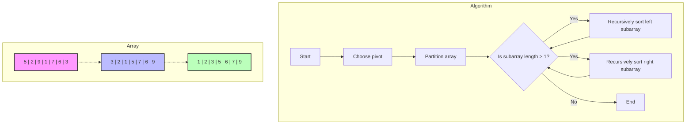
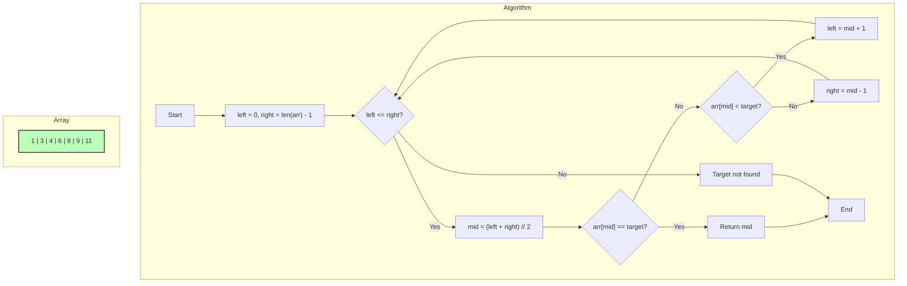
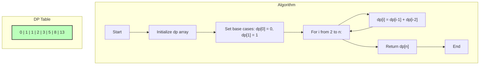
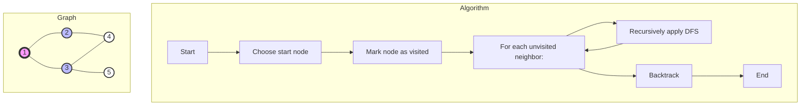
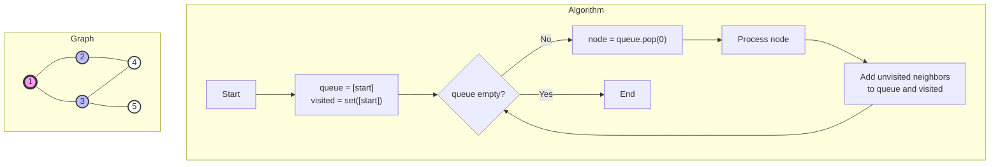
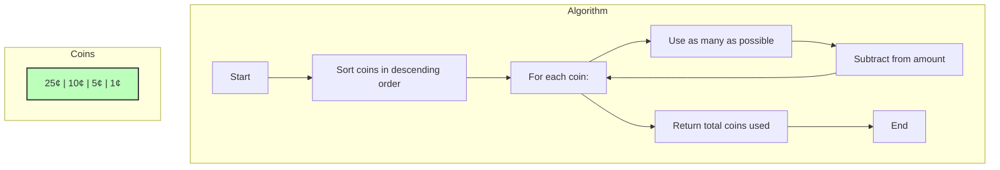
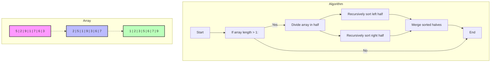
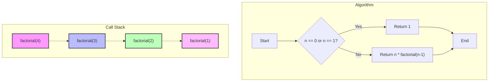
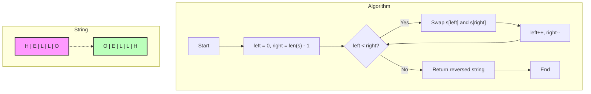
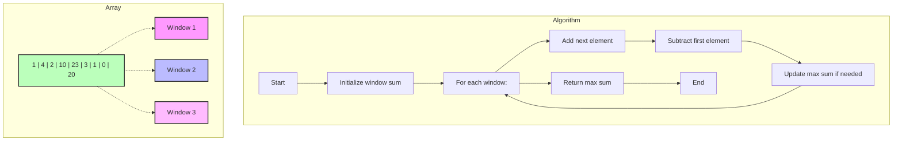

# Visual Guide to Algorithms

This guide provides advanced visual representations of ten fundamental algorithms using Mermaid charts. These visualizations combine algorithm flowcharts with relevant data structure representations to offer a more intuitive understanding for visual learners.

## 1. Sorting Algorithms (Quicksort)

## 2. Searching Algorithms (Binary Search)

## 3. Dynamic Programming (Fibonacci Sequence)

## 4. Depth-First Search (DFS)

## 5. Breadth-First Search (BFS)

## 6. Greedy Algorithms (Coin Change)

## 7. Divide and Conquer (Merge Sort)

## 8. Recursion (Factorial)

## 9. Two-Pointer Technique (String Reversal)

## 10. Sliding Window (Max Sum Subarray)

